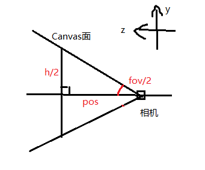

[Back](index.md)


# Canvas World Space屏幕自适应

项目中经常用到World Space 的Canvas渲染模式，它和渲染物体用的是一个相机，在世界坐标系中渲染UI, 使得UI也有景深，可以通过修改z值，改变UI与相机的距离，但是每次修改z，都要重修修改Canvas scale。

这段代码只针对1920*1080的屏幕分辨率，不同屏幕分辨率的适配可以用Canvas Scale或参照NGUI的屏幕适配。


``` csharp
using UnityEngine;
using System.Collections;

// 只在Editor模式下执行，Scale只用计算一次就好
[ExecuteInEditMode]
public class FitCamera : MonoBehaviour
{
    public float ZPosition = 22f;

    void Start()
    {
        if (Application.isEditor && !Application.isPlaying)
        {
            fitCamera();
        }

        // 设置用于在屏幕空间/世界空间中调整画布大小的相机
        GetComponent<Canvas>().worldCamera = Camera.main;
    }

    void Update()
    {
        if (Application.isEditor && !Application.isPlaying)
        {
            fitCamera();
        }
    }

    void fitCamera()
    {
        RectTransform rectTransform = this.GetComponent<RectTransform>();
        rectTransform.sizeDelta = new Vector2(1920, 1080);
        Camera SuperDCamera = Camera.main;

        float pos = ZPosition;
        // 设置Canvas的位置。（相机位置+视差面距离，Canvas放在零视差面上）
        transform.position = SuperDCamera.transform.position + SuperDCamera.transform.forward * pos;
        // 见示意图
        float h = Mathf.Tan(SuperDCamera.fieldOfView * Mathf.Deg2Rad * 0.5f) * pos * 2f;

        // 得到Canvas Y方向上的缩放
        float scaleY = h / rectTransform.rect.height;
        // 根据aspect (width divided by height)，得到Canvas X方向上的缩放
        float scaleX = (h * SuperDCamera.aspect) / rectTransform.rect.width;    
        transform.localScale = new Vector3(scaleX, scaleY, scaleY);
    }

}

```

  
根据field of view角度的一半和相机到canvas位置的距离，可以算出canvas所在位置的高度。