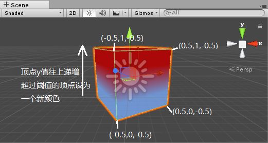

[Back](index.md)

# 颜色渐变

一个用UnlitShader实现的立方体颜色融合shader.  
Unlit默认是不包含光照的，只显示颜色本身或者贴图的颜色，在实际使用时，cube因为没有光照信息，变得区分不出边角，因此Unlit常用于quad的ui或者海报显示。它简单，并且舍去了光照。  


在这个顶点着色器中使用vert & frag函数

```
v2f vert(appdata_base v)
{
	v2f o;
	o.vertex = mul(UNITY_MATRIX_MVP, v.vertex);
	o.y = v.vertex;
	return o;
}

```
计算vertex的时候使用了一次mvp变换，这个很好理解，将顶点转换到屏幕空间。  
o.y? y是什么？被赋予了v.vertex的值，与顶点位置信息一致，先接着往下看。


这个frag函数返回值的语义是COLOR。  
_Center & _R是渐变的中心位置和渐变半径（所谓的过渡带），两个值在属性中有定义，一会看完整代码。  
i.y原来y是高度，顶点高度大于中心位置+过渡半径，则返回_MainColor的颜色，就是全部显示为_MainColor.  
如果在大于中心位置的过渡带中，显示的颜色应该是渐变颜色，计算渐变颜色用了一个插值公式lerp，和dot,pow一样是受gl支持。  

d是侧边顶点高度减去中心点的距离，额，不好脑补，看图吧.  
  

1-d是最高点到当前点的距离，除以_R得到相对与半径的距离半分比，-0.5将值域降到0~1.  

觉得不好理解的话，可以设两个值看看：0.8 & 0.5
d = 0.8 - 0.5 = 0.3   
d = (1 - 0.3 / 0.2) - 0.5 = 0.35  
d = (在0 ~ 1之间) = 0.35  
lerp((1,1,1,1), (0,0,0,1), 0.35) = (0.85, 0.85, 0.85, 1)  

d = 0.5 - 0.5 = 0  
d = (1 - 0 / 0.2) - 0.5 = 0.5  
d = (在0 ~ 1之间) = 0.5  
lerp((1,1,1,1), (0,0,0,1), 0.5) = (0.5, 0.5, 0.5, 1)  

```
struct v2f
{
	float4 vertex : POSITION;
	float y : COLOR; // 用COLOR语义表示要传递的顶点y值
};

fixed4 frag(v2f i) : COLOR
{
	if (i.y > _Center + _R) 
	{
		return _MainColor;
	}
	else if (i.y <= _Center + _R && i.y >= _Center)
	{
		float d = i.y - _Center;
		d = (1 - d / _R) - 0.5;
		d = saturate(d);
		return lerp(_MainColor, _SecondColor, d);
	}
	else if (i.y > _Center - _R && i.y < _Center)
	{
		float d = _Center - i.y;
		d = (1 - d / _R) - 0.5;
		d = saturate(d);
		return lerp(_MainColor, _SecondColor, 1-d);
	}
	else if(i.y <= _Center - _R)
	{
		return _SecondColor;

	}
	return _SecondColor;
}
```


#### 语义

unity只提供了下列语义，vert的变量传递给frag必须声明语义才能被GLSL识别，所以就灵活处理了。  
- POSITION is the vertex position, typically a float3 or float4.
- NORMAL is the vertex normal, typically a float3.
- TEXCOORD0 is the first UV coordinate, typically float2, float3 or float4.
- TEXCOORD1, TEXCOORD2 and TEXCOORD3 are the 2nd, 3rd and 4th UV coordinates, respectively.
- TANGENT is the tangent vector (used for normal mapping), typically a float4.
- COLOR is the per-vertex color, typically a float4.