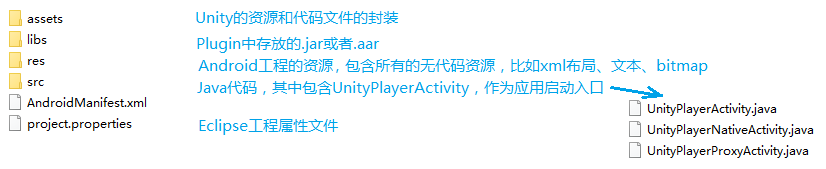
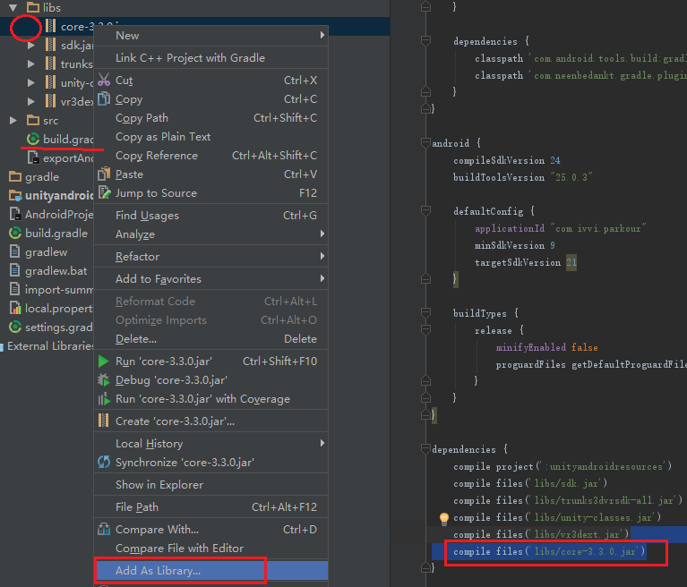

[Back](index.md)
# 在Unity中生成二维码的三种方式

二维码不用多说，随着移动端的发展，二维码变得十分普及，移动支付、链接分享、信息识别，其实二维码有很多种类，中国常用的是QR码，常见于共享单车开锁，微信钱包和支付宝的电子支付，转发或者分享一段文本或者图片，这次的项目中用到了手机扫描大屏幕上的二维码，分享游戏战绩，由于unity build apk提供的多种方式，有三种方式可以生成二维码图片。

大概的需求是游戏结束，把要分享的分数、设备号、时间戳和要宣传的网址，合并成一段url，根据这段url生成QR码，这决定了Unity的逻辑作为项目的主导，由Unity来决定何时调用生成二维码，所以在生成二维码时，Android代码都应该作为辅助。


### 用C#生成二维码

http://dev.twsiyuan.com/2017/02/qrcode-generator-in-unity.html


### 将生成二维码的jar导入Unity


### Unity导出Android Project

[ZXing](https://github.com/zxing/zxing)
二维码识别使用的是Google提供的ZXing开源项目，它支持了一系列条形码和二维码的格式, 提供二维码和条形码的扫描。扫描条形码就是直接读取条形码的内容，扫描二维码是按照自己指定的二维码格式进行编码和解码。

###### 记录我的使用步骤

由于是在Android中编辑这段生成二维码代码，先将Unity工程导出为Android Project，5.6版本可以直接选择导出gradle工程，以gradle构建的工程可以直接被Android Studio识别，我的这个项目使用的Unity版本是5.3，没有导出gradle/ADT的选项，只能导出ADT, 是Eclipse Android项目，用Android Studio不能直接打开，必须要多一个"Import Project"操作，将Unity导出的工程作为一个Android Module导入新的Android Studio Project.

  

以Module的形式导入后，Android Studio会生成一个import-summary.txt文件，记录原ADT工程文件的位置挪动，比如AndroidManifest.xml => app\src\main\AndroidManifest.xml，几乎每个文件都多了几个层级，不喜欢这些层级也没关系，在build.gradle里可以设置路径。  
```
sourceSets {
    main {
        manifest.srcFile 'AndroidManifest.xml'
        assets.srcDirs = ['assets']
        jniLibs.srcDirs = ['libs']
        java.srcDirs = ['src']
        res.srcDirs = ['res']
    }
}
```

使用Android Studio导入core-3.3.0.jar，复制粘贴jar包进libs，这个libs文件夹是当前Module文件夹中的libs，Unity会将Assets/Plugin/Android中的jar全部导出到libs中，assets里则是Unity工程的资源和代码。  

  

光是复制进去是不够的，下图别的jar左边有个小标，可以点开来浏览jar的内容，但core-3.3.0.jar不行，因为还没有编译这个jar，可以右键选择"add as library"，或者在build.gradle添加一行"compile files()"，这两个操作是一样的，add as library的操作实质上就是修改build.gradle的dependencies. 编译通过后，左侧就有个小标可以展开这个jar，浏览里面的代码。  




###### 使用zxing

同事写了一个类，封装了ZXing的二维码生成。

This class implements an output stream in which the data is written into a byte array. The buffer automatically grows as data is written to it. The data can be retrieved using toByteArray() and toString().

``` java
package com.billie.parkour;

import android.graphics.Bitmap;
import android.graphics.Matrix;

import com.google.zxing.BarcodeFormat;
import com.google.zxing.EncodeHintType;
import com.google.zxing.WriterException;
import com.google.zxing.common.BitMatrix;
import com.google.zxing.qrcode.QRCodeWriter;
import com.google.zxing.qrcode.decoder.ErrorCorrectionLevel;

import java.io.ByteArrayOutputStream;
import java.util.Hashtable;

public class QRCodeUtil {

    private static int IMAGE_HALFWIDTH = 50;//宽度值，影响中间图片大小
    /**
     * 生成二维码，默认大小为500*500
     *
     * @param text 需要生成二维码的文字、网址等
     * @return bitmap
     */
    public static byte[] createQRCode(String text) {
        text = "http://www.xxx.com";	// 要分享的url

        ByteArrayOutputStream stream = new ByteArrayOutputStream();		// byte格式的输出流
        createQRCode(text, 500).compress(Bitmap.CompressFormat.PNG, 100, stream);
        byte[] byteArray = stream.toByteArray(); // byte[]可以直接用AndroidJavaObject.Call<byte[]>获取
        return byteArray;
    }

    /**
     * 生成二维码
     *
     * @param text 需要生成二维码的文字、网址等
     * @param size 需要生成二维码的大小（）
     * @return bitmap
     */
    public static Bitmap createQRCode(String text, int size) {
        try {
            Hashtable<EncodeHintType, String> hints = new Hashtable<>();
            hints.put(EncodeHintType.CHARACTER_SET, "utf-8");
            BitMatrix bitMatrix = new QRCodeWriter().encode(text,
                    BarcodeFormat.QR_CODE, size, size, hints);		// BitMatrix是com.google.zxing的类
            int[] pixels = new int[size * size];	// 解析bitMatrix的数据，生成对应的像素数组
            for (int y = 0; y < size; y++) {
                for (int x = 0; x < size; x++) {
                    if (bitMatrix.get(x, y)) {
                        pixels[y * size + x] = 0xff000000;
                    } else {
                        pixels[y * size + x] = 0xffffffff;
                    }

                }
            }
            Bitmap bitmap = Bitmap.createBitmap(size, size,
                    Bitmap.Config.ARGB_8888);
            bitmap.setPixels(pixels, 0, size, 0, 0, size, size);
            return bitmap;
        } catch (WriterException e) {
            e.printStackTrace();
            return null;
        }
    }

    /**
     * 生成带logo的二维码，默认二维码的大小为500，logo为二维码的1/5
     *
     * @param text 需要生成二维码的文字、网址等
     * @param mBitmap logo文件
     * @return bitmap
     */
    public static Bitmap createQRCodeWithLogo(String text, Bitmap mBitmap) {
        return createQRCodeWithLogo(text,500,mBitmap);
    }

    /**
     * 生成带logo的二维码，logo默认为二维码的1/5
     *
     * @param text 需要生成二维码的文字、网址等
     * @param size 需要生成二维码的大小（）
     * @param mBitmap logo文件
     * @return bitmap
     */
    public static Bitmap createQRCodeWithLogo(String text, int size, Bitmap mBitmap) {
        try {
            IMAGE_HALFWIDTH = size/10;
            Hashtable<EncodeHintType, Object> hints = new Hashtable<>();
            hints.put(EncodeHintType.CHARACTER_SET, "utf-8");
            /*
             * 设置容错级别，默认为ErrorCorrectionLevel.L
             * 因为中间加入logo所以建议你把容错级别调至H,否则可能会出现识别不了
             */
            hints.put(EncodeHintType.ERROR_CORRECTION, ErrorCorrectionLevel.H);
            BitMatrix bitMatrix = new QRCodeWriter().encode(text,
                    BarcodeFormat.QR_CODE, size, size, hints);

            int width = bitMatrix.getWidth();//矩阵高度
            int height = bitMatrix.getHeight();//矩阵宽度
            int halfW = width / 2;
            int halfH = height / 2;

            Matrix m = new Matrix();
            float sx = (float) 2 * IMAGE_HALFWIDTH / mBitmap.getWidth();
            float sy = (float) 2 * IMAGE_HALFWIDTH
                    / mBitmap.getHeight();
            m.setScale(sx, sy);
            //设置缩放信息
            //将logo图片按martix设置的信息缩放
            mBitmap = Bitmap.createBitmap(mBitmap, 0, 0,
                    mBitmap.getWidth(), mBitmap.getHeight(), m, false);

            int[] pixels = new int[size * size];
            for (int y = 0; y < size; y++) {
                for (int x = 0; x < size; x++) {
                    if (x > halfW - IMAGE_HALFWIDTH && x < halfW + IMAGE_HALFWIDTH
                            && y > halfH - IMAGE_HALFWIDTH
                            && y < halfH + IMAGE_HALFWIDTH) {
                        //该位置用于存放图片信息
                        //记录图片每个像素信息
                        pixels[y * width + x] = mBitmap.getPixel(x - halfW
                                + IMAGE_HALFWIDTH, y - halfH + IMAGE_HALFWIDTH);
                    } else {
                        if (bitMatrix.get(x, y)) {
                            pixels[y * size + x] = 0xff000000;
                        } else {
                            pixels[y * size + x] = 0xffffffff;
                        }
                    }
                }
            }
            Bitmap bitmap = Bitmap.createBitmap(size, size,
                    Bitmap.Config.ARGB_8888);
            bitmap.setPixels(pixels, 0, size, 0, 0, size, size);
            return bitmap;
        } catch (WriterException e) {
            e.printStackTrace();
            return null;
        }
    }

}

```

在Unity代码中我们要获取上面生成二维码的byte[]，再生成bitmap，其实多了一个不必要的步骤，上面代码是已经生成了一个bitmap的，只不过为了向Unity传数据方便，给转换成了byte[]。如果是直接使用bitmap，可以用一种原生Opengl ES 2.0的方式，将bitmap转换成textureId，在Unity中可以用Texture2D.CreateExternalTexture()创建出来。  

###### Android平台获取图片的3种方式

1. WWW不用说，非常简单。  

``` csharp
using UnityEngine;
using System.Collections;

// Get the latest webcam shot from outside "Friday's" in Times Square
public class ExampleClass : MonoBehaviour
{
    public string url = "http://images.earthcam.com/ec_metros/ourcams/fridays.jpg";

    IEnumerator Start()
    {
        // Start a download of the given URL
        WWW www = new WWW(url);

        // Wait for download to complete
        yield return www;

        // assign texture
        Renderer renderer = GetComponent<Renderer>();
        renderer.material.mainTexture = www.texture;
    }
}
```

2. 用Android下载图片，生成bitmap后转换为byte[]，用AndroidJavaObject.Call<byte[]>()获取。

``` csharp
public class GenerateQRcode 
{	
	void Start()
	{
		if(Application.platform == RuntimePlatform.Android)
		{
			// 用包名+类名的方式，找到并构造一个AndroidJavaClass
			AndroidJavaClass jc = new AndroidJavaClass("com.billie.parkour.QRCodeUtil");
			// Call a static Java method on a class.
			byte[] imgBytes = jc.CallStatic<byte[]>("createQRCode");

			Texture2D texture = new Texture2D(128, 128);
			texture.LoadImage(imgBytes);

			Sprite sprite = Sprite.Create(texture, new Rect(0f, 0f, texture.width, texture.height), new Vector2(0.5f, 0.5f), 100f);
			qrcodeImage.sprite = sprite;
		}
	}	
}
```

3. Texture2D.CreateExternalTexture 在外部创建原生纹理对象。

``` csharp
AndroidJavaObject bitmap = activity.Call<AndroidJavaObject>("getBitmap", url);
width = bitmap.Call<int>("getWidth");
height = bitmap.Call<int>("getHeight");

if(bitmap != null) 
{
	int nativeTextureID = activity.Call<int>("genTextureId", bitmap);
	Texture2D texture = Texture2D.CreateExternalTexture(width, height, TextureFormat.RGBA32, false, false, (IntPtr)textureId);
}
```

对应的Android方法：

``` java
public Bitmap getBitmap(String url) {

    url = appendUrl(url, 256, 256);

    WeakReference<Bitmap> cacheRef = GLBitmapMaps.get(url);
    Bitmap bitmap = null;
    if(cacheRef != null && cacheRef.get() != null){
        bitmap = cacheRef.get();
    }
    if(bitmap == null) {
        BoxLog.debug(TAG, "getBitmap url:" + url);
        bitmap = ImageLoader.getInstance().loadImageSync(url, displayImageOptions);

        boolean isExceeding = GLBitmapMaps.size() >= MAX_BITMAP_POOL;

        // check invalided
        Iterator<Map.Entry<String, WeakReference<Bitmap>>> iterator = GLBitmapMaps.entrySet().iterator();

        while (iterator.hasNext()) {
            WeakReference<Bitmap> bitmapRef = iterator.next().getValue();
            Bitmap b = bitmapRef.get();
            if(b == null || b.isRecycled()) {
                iterator.remove();
                isExceeding = false;
            }

            if(!iterator.hasNext() && isExceeding) {
                if(!b.isRecycled()) {
                    b.recycle();
                }
                iterator.remove();
            }
        }

        // put
        WeakReference<Bitmap> wref = new WeakReference<Bitmap>(bitmap);
        GLBitmapMaps.put(url, wref);
    }
    if (bitmap != null) {
        Matrix flip = new Matrix();
        flip.postScale(1f, -1f);
        Bitmap bmp = Bitmap.createBitmap(bitmap, 0, 0, bitmap.getWidth(), bitmap.getHeight(), flip, true);

        return bmp;
    }
    return bitmap;
}

// ---

public int genTextureId(Bitmap bitmap) {
    if (bitmap == null)
        return 0;
    int[] newTexId = new int[1];
    GLES20.glGenTextures(1, newTexId, 0);
    int textureId = newTexId[0];
    if (newTexId[0] != 0) {
        GLES20.glBindTexture(GLES20.GL_TEXTURE_2D, textureId);
        GLES20.glTexParameteri(GLES20.GL_TEXTURE_2D, GLES20.GL_TEXTURE_MIN_FILTER, GLES20.GL_LINEAR);
        GLES20.glTexParameteri(GLES20.GL_TEXTURE_2D, GLES20.GL_TEXTURE_MAG_FILTER, GLES20.GL_LINEAR);
        GLES20.glTexParameteri(GLES20.GL_TEXTURE_2D, GLES20.GL_TEXTURE_WRAP_S, GLES20.GL_CLAMP_TO_EDGE);
        GLES20.glTexParameteri(GLES20.GL_TEXTURE_2D, GLES20.GL_TEXTURE_WRAP_T, GLES20.GL_CLAMP_TO_EDGE);
        GLUtils.texImage2D(GLES20.GL_TEXTURE_2D, 0, GLES20.GL_RGBA, bitmap, 0);
        bitmap.recycle();
    }
    return textureId;
}

// 外加上一个销毁texture的方法
public void destroyTextureId(int textureId, String url) {
    GLES20.glDeleteTextures(1, new int[]{textureId}, 0);
}
```


