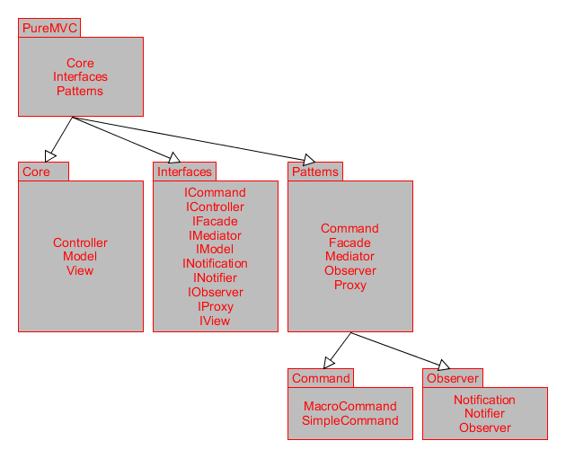
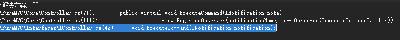

[Back](index.md)

# PureMVC框架-我的理解

这个框架有很多语言版本，涵盖了各大主流语言，最早是ActionScript版本，因为轻量好用，就有了很多语言的实现，它主要是基于观察者模式，通过注册类，发送消息的方式，进行各模块/类之间的解耦。

我使用的是Unity C#语言版本，听说这个框架已经很久没有更新了，但不影响它的使用与体验，它提供了dll和源码的两种方式，所以我们能看到它精巧的代码结构，作为一个项目框架，PureMVC的代码量可以说是非常少的了，是个很好的学习资料。

这是Unity版本的PureMVC代码结构图，其他版本可能有些差别，但大体上一致。


从框架结构上来看，这张IBM绘制的图很好地体系了MVC相互之间的关联。


3大模块体系分别是数据、控制、界面，对应PureMVC里则是Proxy\Command\Mediator，Facade则是整个框架的入口，负责初始化各个模块，而且也可以通过Facade向框架的执行层发送消息，这一点非常好，外部调用内部具体的某个内容，不需要知道内部的具体实现，只需要在相应位置写好接收操作，这样对外提供接口也非常方便，相当于所有的消息，都“揉合”到了一处，循序执行到了某个消息的时候，有对应的接收处理，至于这个接收处理写在何处，框架本身并不关心。

而在框架内部，也可以相互发消息，解开了相互之间的对象引用关系，所有的汇聚到一个点，就像通信基站，我只需要知道基站即可，至于找到那个手机号码，就是基站负责的事情了。


### Facade 启动框架的入口

它在namespace PureMVC.Patterns里，我新建GameFacade类继承Facade，在整个框架启动时，会创建GameFacde对象，调用InitializeFacade()做MVC的初始化操作，从代码中看只是创建了他们三个的单例对象。这些类都实现了他们对应的接口。

> 接口类似于抽象基类。 实现接口的任何类或结构都必须实现其所有成员。  
> 接口无法直接进行实例化。 其成员由实现接口的任何类或结构来实现。  
> 接口可以包含事件、索引器、方法和属性。  
> 接口不包含方法的实现。  
> 一个类或结构可以实现多个接口。 一个类可以继承一个基类，还可实现一个或多个接口。  


``` csharp
// 这些是静态对象，用了同步锁去创建相应的对象
// 从接口定义上可以清晰看到这是以MVC划分的框架
public static PIController Instance
{
	get
	{
		if (m_instance == null)
		{
			lock (m_staticSyncRoot)
			{
				if (m_instance == null) m_instance = new PController();
			}
		}

		return m_instance;
	}
}


public static IModel Instance
{
	get
	{
		if (m_instance == null)
		{
			lock (m_staticSyncRoot)
			{
				if (m_instance == null) m_instance = new Model();
			}
		}

		return m_instance;
	}
}

public static PIView Instance
{
	get
	{
		if (m_instance == null)
		{
			lock (m_staticSyncRoot)
			{
				if (m_instance == null) m_instance = new PView();
			}
		}

		return m_instance;
	}
}


```


### Command 外部命令处理

GameFacade中注册了需要从外部发送的命令，由Command接收命令并处理，在不同Command中处理的命令需要对应起来，在Facade构造函数中注册，使用方式也很简单，Facade公开了SendNotification(string notificationName)方法给外部，可直接通过Facade或者派生类来调用。  


``` csharp
// 在Controller中实现注册命令
public virtual void RegisterCommand(string notificationName, Type commandType)
{
	lock (m_syncRoot) // 我没看到框架里开线程的“明文代码”
	{
		if (!m_commandMap.ContainsKey(notificationName))
		{
			// This call needs to be monitored carefully. Have to make sure that RegisterObserver
			// doesn't call back into the controller, or a dead lock could happen.
			m_view.RegisterObserver(notificationName, new Observer("executeCommand", this));
		}

		m_commandMap[notificationName] = commandType;
	}
}

// 在View中实现注册观察者
protected IDictionary<string, IList<IObserver>> m_observerMap;

public virtual void RegisterObserver(string notificationName, IObserver observer)
{
	lock (m_syncRoot)
	{
		if (!m_observerMap.ContainsKey(notificationName))
		{
			m_observerMap[notificationName] = new List<IObserver>();
		}

		// 比如可以注册多个Mediator
		m_observerMap[notificationName].Add(observer);
	}
}


// 通知这些观察者
public virtual void NotifyObservers(INotification notification)
{
	IList<IObserver> observers = null;

	lock (m_syncRoot)
	{
		if (m_observerMap.ContainsKey(notification.Name))
		{
			// Get a reference to the observers list for this notification name
			IList<IObserver> observers_ref = m_observerMap[notification.Name];
			// Copy observers from reference array to working array, 
			// since the reference array may change during the notification loop
			observers = new List<IObserver>(observers_ref);
		}
	}

	// Notify outside of the lock
	if (observers != null)
	{
		// Notify Observers from the working array				
		for (int i = 0; i < observers.Count; i++)
		{
			IObserver observer = observers[i];
			observer.NotifyObserver(notification);
		}
	}
}


public virtual void NotifyObserver(INotification notification)
{
	object context;
	string method;

	// Retrieve the current state of the object, then notify outside of our thread safe block
	lock (m_syncRoot)
	{
		context = NotifyContext;
		method = NotifyMethod;
	}

	Type t = context.GetType();

	// 为了获取返回值，必须指定 BindingFlags.Instance 或 BindingFlags.Static
	// 指定 BindingFlags.Public 可在搜索中包含公共成员
	// BindingFlags.IgnoreCase，表示忽略 name 的大小写
	BindingFlags f = BindingFlags.Instance | BindingFlags.Public | BindingFlags.IgnoreCase;

	MethodInfo mi = t.GetMethod(method, f);
    try
    {
        mi.Invoke(context, new object[] { notification }); // 全局调用符合条件的方法
    }
    catch(Exception e)
    {
        UnityEngine.Debug.LogError(e.ToString());
    }
}


```

看完后，会觉得很奇怪，GameCommand在Execute()接收消息进行区分并执行目标代码，但是上面的代码并没有哪里调用Execute啊！我只看到了一个new Observer("executeCommand", this)的对象。  
那就对了，就是它！mi.Invoke全局调用executeCommand这个方法，如果定位不到，可以使用一次Visual Studio的全局查找。  

  

全局共有三处executeCommand字符串（不区分大小写），IController中定义了这个方法，Controller则实现了这个接口，调用了Execute，等等，这不就是上文GameCommand的Execute()吗。我的GameCommand继承了SimpleCommand，而SimpleCommand实现了ICommand的Execute(INotification notification)方法，所以GameCommand就变成了重写Execute，调用到这里就结束了。  


``` csharp
public virtual void ExecuteCommand(INotification note)
{
	Type commandType = null;

	lock (m_syncRoot)
	{
		if (!m_commandMap.ContainsKey(note.Name)) return;
		commandType = m_commandMap[note.Name];
	}

	object commandInstance = Activator.CreateInstance(commandType);

	if (commandInstance is PICommand)
	{
		((PICommand) commandInstance).Execute(note);
	}
}

```


INotification接口里包含多个属性，通过Name区分各通知的处理内容，用Body可以传递一些参数，在方便的同时，也添加了一点装箱拆箱的消耗。
``` csharp
public interface INotification
{
    /// <summary>
    /// The name of the <c>INotification</c> instance
    /// </summary>
    /// <remarks>No setter, should be set by constructor only</remarks>
	string Name { get; }

    /// <summary>
    /// The body of the <c>INotification</c> instance
    /// </summary>
	object Body { get; set; }
	
    /// <summary>
    /// The type of the <c>INotification</c> instance
    /// </summary>
	string Type { get; set; }

    /// <summary>
    /// Get the string representation of the <c>INotification</c> instance
    /// </summary>
    /// <returns>The string representation of the <c>INotification</c> instance</returns>
    string ToString();
}

```


### Proxy 获取数据

网络请求和文件读写的相关代码我会放在这，在首次使用时，向Facade注册GameProxy, 之后的使用，也需要向Facade取回GameProxyProxy对象，简而言之，一切MVC操作都要让Facade知道。追溯这个方法，找到了它在Model层的实现。

Proxy负责的代码没什么好说的，C#该怎么实现怎么实现，必要时用Loom开线程，获取完了数据各种SendNotification给Mediator，随意了。  

``` csharp
public virtual IProxy RetrieveProxy(string proxyName)
{
	lock (m_syncRoot)
	{
		if (!m_proxyMap.ContainsKey(proxyName)) return null;
		return m_proxyMap[proxyName];
	}
}

```


### Mediator 界面实现相关

获取完数据对应的就是界面的更新了，同样所有的Mediator都要向Facade注册，Facade是全局掌控者~  
我定义了两个Mediator，都继承自Mediator，在注册Mediator时，Mediator里的ListNotificationInterests()里，有添加在list列表中的消息名才会在SendNotification()时被调用到，没有添加的在全局调用HandleNotification()使用会直接忽视。  

``` csharp
public virtual void RegisterMediator(IMediator mediator)
{
	lock (m_syncRoot)
	{
		// do not allow re-registration (you must to removeMediator fist)
		if (m_mediatorMap.ContainsKey(mediator.MediatorName)) return;

		// Register the Mediator for retrieval by name
		m_mediatorMap[mediator.MediatorName] = mediator;

		// Get Notification interests, if any.
		IList<string> interests = mediator.ListNotificationInterests();

		// Register Mediator as an observer for each of its notification interests
		if (interests.Count > 0)
		{
			// Create Observer
			// 啊哈！发现handleNotification的调用了！
			IObserver observer = new Observer("handleNotification", mediator);

			// Register Mediator as Observer for its list of Notification interests
			for (int i = 0; i < interests.Count; i++)
			{
				// 它注册这些观察者是根据ListNotificationInterests中添加的NotificationName来的
				RegisterObserver(interests[i].ToString(), observer);
			}
		}
	}

	// alert the mediator that it has been registered
	mediator.OnRegister();
}

```

代码的套路和Command.Execute一样，以后还可以补充。