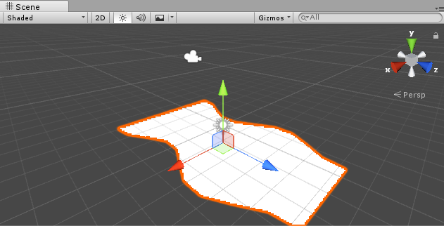
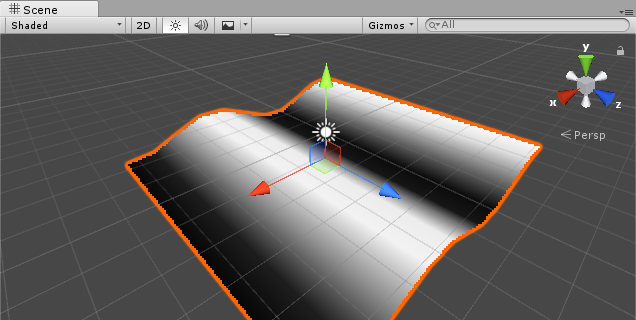
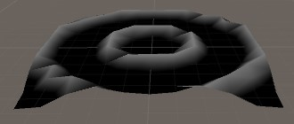
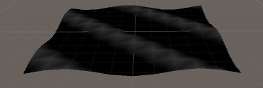
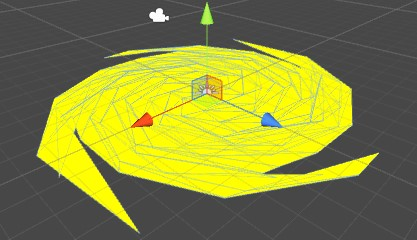

[返回](index.md)

# 顶点动画

顶点动画最常见于规律性的海洋波浪，空中飘舞的旗帜。

有规律可循的变换是计算机程序的强项，程序的计算模拟重复性或者随机性的动画，如波浪、漩涡，在没有其他因素干扰的情况下，他们都会保持一定的系数继续维持当前状态，所以用顶点动画来实现这类动画效果是最方便的，并且使用代码的变换计算对于骨骼或者帧动画来说，性能消耗更小，而且人工实现起来，需要较少的工时。

那么顶点动画是怎么实现的？简单看下unity调用opengl的渲染流程：

unity把模型顶点数据封装起来，由cpu统一发送给gpu，gpu拿到顶点后，在顶点函数中，对每个顶点进行MVP变换后，抛弃被遮挡和屏幕外不可见的顶点，剩下的顶点交由片段函数，进行片元的逐像素处理，最后输入缓冲区，渲染到屏幕。  

所以在顶点函数中，我们可以获取每个顶点的位置、顶点颜色、UV坐标，并且对它们进行修改变换。  
对于渲染画面而言，并不只是调用渲染管线一次就可以，而是无论画面是否改变，要持续不停地调用，在画面渲染的循环过程中，可以每一帧都改变顶点位置，在一秒的多张画面中，就有了动画效果。


###### 顶点移动

这是一个z轴方向的动画，有点像蜗牛与地面接触的部分？



```
v2f vert(appdata v)
{
	v2f o;
	float4x4 m = {
		float4(sin(v.vertex.z + _Time.y) / 8 + 0.5, 0, 0, 0),
		float4(0, 1, 0, 0),
		float4(0, 0, 1, 0),
		float4(0, 0, 0, 1)
	};
	v.vertex = mul(m, v.vertex);
	o.vertex = mul(UNITY_MVP_MATRIX, v.vertex);
	o.uv = TRANSFORM_TEX(v.uv, _MainTex);
	return o;
}
```
GLSL提供了sin等多个三角函数，_Time是Unity shader 提供的内置变量，有几个不同速度的Time.
> _Time	float4	Time (t/20, t, t*2, t*3), use to animate things inside the shaders.

除了_Time，unity还提供了_SinTime, _CosTime, unity_DeltaTime等，可以在unity documentation上查到。

在OpenGL中，由于某些原因我们通常使用4×4的变换矩阵，而其中最重要的原因就是大部分的向量都是4分量的。我们能想到的最简单的变换矩阵就是单位矩阵(Identity Matrix)。单位矩阵是一个除了对角线以外都是0的N×N矩阵。 
|1 0 0 0|
|0 1 0 0|
|0 0 1 0|
|0 0 0 1|

这在这一段函数中，用每个顶点的z分量计算顶点x值，我们无法使用x分量来计算x，因为在一次计算后，x分量的值已经改变了，z是不会变的分量，同时随着靠近摄像机的远近，线性增减，所以这个动画是向着z轴正方向移动的.将x保存到m矩阵，补齐它在y,z,w的值，这三个值并不需要改变，从乘法角度1*n=n本身，随后m矩阵对v.vertex进行变换乘法，最后是MVP变换。


#### 水波纹



```
struct v2f
{
    float4 color : COLOR;
    float4 vertex : SV_POSITION;
};
v2f vert (appdata v)
{
    v2f o;
    // A * sin(B * x + c)分别是振幅/频率/偏移
    v.vertex.y = 0.5 * sin(v.vertex.x + _Time.y) + 0.5; 
    o.vertex = UnityObjectToClipPos(v.vertex);

    float r = v.vertex.y;
    o.color = float4(r, r, r, 1);
    return o;
}
float4 frag (v2f i):COLOR
{
    return i.color;
}
```
这次是直接修改v.vertex的y分量，没有再做矩阵乘法，两种都可以，这种更加直接简单点，编程起来更加方便，乘以0.5改变的y的上下浮动范围，这个公式是初中数学的，貌似叫正弦公式。为了更加清楚看到每个顶点的高度，我把顶点颜色设置为



或者是使用原点到顶点xz的长度作为变化参数，得到一个这样的从外向内的圆圈图形变换
```
//要想圆圈从圆心出发，将lenght(v.vertex.xz)取负数即可
v.vertex.y = 0.5 * sin(length(v.vertex.xz) * 2 + _Time.y);
```




### 顶点旋转

在顶点函数中，顶点的位置可以任意通过矩阵变换得到，矩阵的变换就运用到了之间课程的数学知识，变换后的顶点位置再做一次MVP变换，得到摄像机所见的图像，下图这个“风车”会正向逆向交替转动。



所有顶点都围绕y轴旋转了angle度，angle是离中心点越远角度越大，然后要让这个角度不断随着时间变换，unity shader提供了_SinTime，这个随着时间变化的正弦值，注意这个正弦值是fixed4，它的x/y/z/w的值都不相同。这个顶点的变换涉及到矩阵乘法计算空间中的围绕轴旋转，下列代码中是围绕y轴的顶点选择变换。  

```
v2f vert(appdata_base i)
{
	v2f o;
	fixed angle = length(i.vertex) * _sinTime.w;
	fixed4 m = {
		fixed4(cos(angle), 0, sin(angle), 0),
		fixed4(0, 1, 0, 0),
		fixed4(-sin(angle), 0, cos(angle), 0),
		fixed4(0, 0, 0, 1)
	};

	m = mul(UNITY_MATRIX_MVP, m);
	o.vertex = mul(m, i.vertex);
}
```

1. 绕x轴旋转
	1		0		0		0
	0	  	cos		sin 	0
	0	    -sin 	cos 	0
	0		0		0		1
2. 绕y轴旋转
	cos		0		-sin 	0
	0		1		0		0
	sin 	0		cos		0
	0		0		0		1
3. 绕z轴旋转
	cos		sin 	0 		0
	-sin 	cos		0		0
	0		0		1		0
	0		0		0		1

这些矩阵可以由二维推到而来，详细请看[这](http://www.cnblogs.com/graphics/archive/2012/08/08/2609005.html)

[这里](http://www.opengl-tutorial.org/cn/beginners-tutorials/tutorial-3-matrices/)介绍了坐标空间和MVP变换。