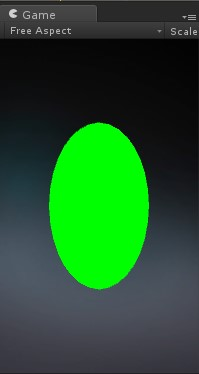
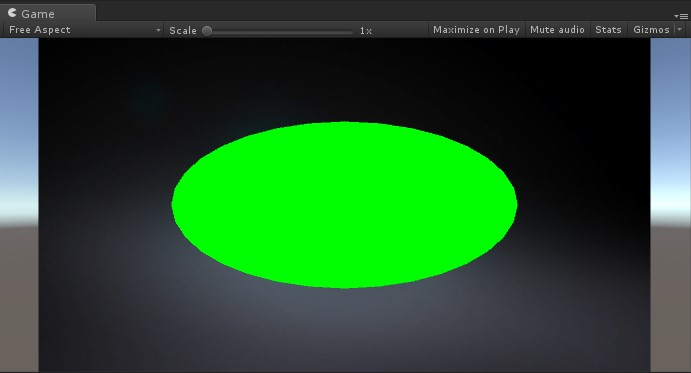

[Back](index.md)
# 顶点着色器

在Unity中，顶点着色器(Vertex Shader)总是和片段着色器(Fragment Shader)一起，先由顶点着色器计算完顶点的光照后，再输入到片段着色器插值化单位像素的光照结果，经片段着色器处理后的表面信息会更加平滑，阴影渐变的更加柔和。

在OpenGL中，顶点着色器可能非常简单，只是将数据复制传递给下一个着色阶段，也可以执行一些复杂的操作，比如执行大量的计算来得到顶点在屏幕上的位置（mvc变换矩阵），或通过光照计算来判断顶点的颜色。所有的操作都是基于顶点的，顶点着色器对每个顶点都执行一次运算，过多的顶点会降低顶点着色器的运行速度（这取决于显卡性能）。

顶点着色器的结构
```
Pass {
    // ... the usual pass state setup ...

    CGPROGRAM
    // compilation directives for this snippet, e.g.:
    // vert和frag是顶点和片段着色器的函数名，可以随意修改，只需要在这里申明
    #pragma vertex vert
    #pragma fragment frag

    // the Cg/HLSL code itself

    ENDCG
    // ... the rest of pass setup ...
}
```
ShaderLab着色器使用Cg/HLSL语言编写的，在内层的CGPROGRAM中，外层套的是Unity可识别的特定格式代码，可以在Unity Inspector面板显示shader的参数。  


这是一个简单的顶点着色器，用颜色展示法线信息。
```
Shader "Tutorial/Display Normals" {
    SubShader {
        Pass {

            CGPROGRAM

            #pragma vertex vert
            #pragma fragment frag
            #include "UnityCG.cginc"

            struct v2f {
                float4 pos : SV_POSITION;
                fixed3 color : COLOR0;
            };

            v2f vert (appdata_base v)
            {
                v2f o;
                o.pos = mul (UNITY_MATRIX_MVP, v.vertex);
                o.color = v.normal * 0.5 + 0.5;
                return o;
            }

            fixed4 frag (v2f i) : SV_Target
            {
                return fixed4 (i.color, 1);
            }
            ENDCG

        }
    }
}

```
如果你把这个shader的材质球赋值给一个模型，会看到这样的效果


大致解释下这个shader做了些什么，在开头的#pragma定义了vertex的函数vert和fragment的函数frag，将UnityCG.cginc包含进来，因为引用到了内置的appdata_base，这是一个内置的结构体，包含了光照、内发光、法线等基础信息，定义一个vert输出结构体v2f，包含顶点和颜色信息，当然这个颜色信息是对于顶点数据来说的，接着就要实现vert和frag函数，mul()是Cg/HLSL提供的矩阵相乘函数，和dot一样，我们了解它的原理和结果就好了，怎么运算是另一篇比较偏数学的文章去详细铺开，这里不做过多解析，回到mul()里的两个参数，v.vertex是appdata_base提供的顶点，UNITY_MATRIX_MVP矩阵是实现MVP变换的重点。  
在MVP变换后，vertex shader得到了世界坐标系的顶点颜色信息，将其传入frag，SV_Target是吧用户的输入颜色存储到一个渲染目标中，这里将输入到默认的帧缓冲中，前面我们定义color是fixed3，因此要构建一个fixed4的颜色变量，第四个参数是alpha，完全不透明输入1.


## Shader语义
在HLSL着色器程序中，输入输出变量都包含一定的含义，这是标准HLSL着色器语言的要求。

### Vertex shader 输入变量语义
#pragma定义顶点函数的全部输入变量都必须包含语义，这样的好处是我们可以很容易理解输入输出了哪些东西，并且知道他们在函数中做了什么事情，Mesh网格数据的顶点位置、法线、uv坐标都可以一一对应。

来看一个使用顶点位置和纹理坐标的简单着色器程序，它使用纹理的像素值作为颜色的输出：
```
Shader "Unlit/Show UVs"
{
    SubShader
    {
        Pass
        {
            CGPROGRAM
            #pragma vertex vert
            #pragma fragment frag

            struct v2f {
                float2 uv : TEXCOORD0;
                float4 pos : SV_POSITION;
            };

            v2f vert (
                float4 vertex : POSITION, // vertex position input
                float2 uv : TEXCOORD0 // first texture coordinate input
                )
            {
                v2f o;
                o.pos = UnityObjectToClipPos(vertex);
                o.uv = uv;
                return o;
            }
            
            fixed4 frag (v2f i) : SV_Target
            {
                return fixed4(i.uv, 0, 0);
            }
            ENDCG
        }
    }
}
```
为了避免一个个输入参数，上面的程序定义了一个结构体，来封装输入参数，Unity也提供了很多的内置输入结构体，可以在UnityCG.cginc找到。

### Fragment shader 输出变量语义
大多数情况下Fragment shader都输出颜色，同时赋予SV_Target语义。上个实例中的frag函数的返回值是fixed4，这是一个低精度的RGBA颜色值，作为一个唯一返回值，SV_Target的语义是该函数本身。返回值也可以是个结构体，封装结构体的好处是将所有内容都返回，而不只是颜色信息，下面的例子是将fixed4值封装在fragOutput结构体中。
```
struct fragOutput {
    fixed4 color : SV_Target;
};            
fragOutput frag (v2f i)
{
    fragOutput o;
    o.color = fixed4(i.uv, 0, 0);
    return o;
}
```

**SV_Target: Multiple render targets**
它可以叠加渲染结果，叠加之前顶点函数的光照渲染结果，它被用来保存一次性渲染的多个结果。

[这里](https://docs.unity3d.com/Manual/SL-ShaderSemantics.html)可以阅读更多信息。


## MVP变换

模型（Model）、视图（View）和投影（Projection）矩阵
- 模型变换：用于操纵模型和其中的特定对象，这里的模型指的是点的笛卡尔坐标，变换将对象移动到需要的位置，然后对他们进行旋转和缩放，但这些变换要遵从变换顺序，模型的变换不遵从乘法结合律，不同的变换顺序将会得到不同的结果。
- 视图变换：将模型位置变换到参考坐标系，即世界空间，它和模型变换的顺序是可以交换的。
- 投影变换：投影变换将在模型视图变换之后应用到顶点上，这种投影定义了视景体并创建了裁剪平面。投影变换有两种:正投影和透视投影。
    * 正投影(orthographic projection)，所有多边形都是按同样相对大小来在屏幕上绘制的。线和多边形使用平行线来直接映射到2D屏幕上。适合蓝图、文本等二维图形。
    

    * 透视投影(perspective projection)，通过非平行线来把图形映射到2D屏幕上，有透视缩短的特点，更加贴近现实。
    


来一个稍微负责点，多几个纹理的shader:
```
Shader "Unlit/NewUnlitShader"
{
    Properties
    {
        _MainTex ("Texture", 2D) = "white" {}
    }
    SubShader
    {
        Tags { "RenderType"="Opaque" }
        LOD 100

        *LOD是Shader Level of Detail的缩写，仅在使用Shader和SubShader语言环境下，LOD小于给定值情况下有效。默认LOD值范围是无穷的，但Shader支持的硬件水平不同，故规定一个最低支持限额。*
            - *VertexLit kind of shaders = 100*
            - *Decal,  Reflective VertexLit = 150*
            - *Diffuse = 200*
            - *Diffuse Detail, Reflective Bumped Unlit, Reflective Bumped VertexLit = 250*
            - *Bumped, Specular = 300*
            - *Bumped Specular = 400*
            - *Parallax = 500*
            - *Parallax Specular = 600*

        Pass
        {
            CGPROGRAM
            #pragma vertex vert
            #pragma fragment frag
            *vert , frag是两个方法名称如下，两地需要保持一致*
            #include "UnityCG.cginc"

            struct appdata
            {
                float4 vertex : POSITION;
                float2 uv : TEXCOORD0;
            };

            struct v2f
            {
                float2 uv : TEXCOORD0;
                float4 vertex : SV_POSITION;
            };
            *这两个地方(POSITION & SV_POSITION)可以交换，试验过没什么区别。*

            sampler2D _MainTex;
            float4 _MainTex_ST;
            
            v2f vert (appdata v)
            {
                v2f o;
                o.vertex = mul(UNITY_MATRIX_MVP, v.vertex);
                o.uv = TRANSFORM_TEX(v.uv, _MainTex);
                return o;
            }
            *处理顶点信息*
            
            fixed4 frag (v2f i) : SV_Target
            {
                // sample the texture
                fixed4 col = tex2D(_MainTex, i.uv);
                return col;
            }
            *处理片元，每个片区贴片相应贴图*
            ENDCG
        }
    }
}

```
在这个shader中添加了texture，有texture就必然有uv，在程序中定义uv的是TEXCOORD0, 其实一共有TEXCOORD0~7(共8个)，也就是说unity shader最多支持7张纹理图片的渲染，不过根据不同平台的性能，android手机下建议最多2张，否则对性能来说是个极大的开销。  
上面的程序中只用了一张贴图，属性可以让你创建一个可视化面板来调整shader，而不需要更改shader的代码，在Properties中定义了一个_MainTex，它的格式是
```
Properties
{
    _Name ("GUI Inspector Title", Type) = value
}
```

完成了unity Inspector面板的属性定义后，要在CGPROGRAM中声明使用的属性变量，而且变量名称要和Properties中保持一致，表示我在Properties声明了，然后在CGPROGRAM中使用，否则CGPROGRAM是不会存在这样一个变量的，并且unity编译后报错“undefined variable”


一个非常简单的着色器
```
Shader "Unlit/NewUnlitShader"
{
    SubShader
    {
        Pass 
        {
            CGPROGRAM
            #pragma vertex vert
            #pragma fragment frag
            void vert(in float2 objPos : POSITION, out float4 pos : POSITION)
            {
                pos = float4(objPos, 0, 1);		// - 1
            }
            void frag(inout float4 col:COLOR)
            {
                col = float4(0, 1, 0, 1);
            }
         ENDCG
        }
    }
}
```
作用是输出一个纯色的绿色无光照球体，可以随着Game面板的缩放而变化，高宽是屏幕的一半。
运行截图：



上述代码1处：直接取objPos的x,y值填充一个float4值，这和GLSL语言特性保持一致。
类型之间可以进行等价转换
```
vec3 velocity = vec3(0.0, 2.0, 3.0);
ivec3 steps = ivec3(velocity);
```

向量的构造函数还可以截断或者加长一个向量
```
vec4 color;
vec3 RGB = vec3(color);

vec3 white = vec3(1.0);
vec4 translucent = vec4(white, 0.5);
```

> 注意：Unity shader中嵌套的Cg语言，是每行以分号结束的，最近写lua差点要忘记shader。


