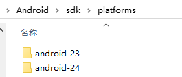
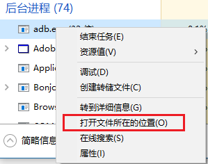
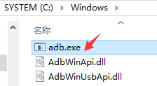
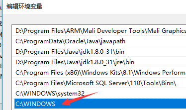

[Back](index.md)

# ADB配置环境变量的一个“坑”

我最早使用的是Eclipse，Android sdk是自己下载来选择位置摆放，在Eclipse中做一个路径引用就好了，由于Eclipse或者ADT是直接解压可用的，所以不存在IDE帮你安装些什么东西，配置系统变量注册表啥的，全部都是手工操作，sdk路径、adb路径自己清楚，包括几个sdk版本都是复制进去就ok。

adb环境变量也配置妥，一切工作正常，也许因为能打开cmd直接用adb的喜悦吧思考冲淡了，就理所当然地认为这个adb就是环境变量中配置路径下的。可是某一天起Google不支持ADT了，推荐大家都使用Android Studio，这东西可以说对新手非常友好，Windows系统下直接.exe双击完事，没有留意到它把我的adb路径替换了，估计是环境变量的系统路径优先级较高，或者在环境变量列表中排列靠前的原因，我需要使用新版本adb，重新配置了环境变量后，引用不到新版本的adb，始终查看adb version是旧版本。

还好任务管理器可以查看进程的文件位置。  
  

在C:\Windows中找到了这个旧版adb，就是你了藏匿的真深，不是要更新版本，根本不知道我一直使用的是你这个adb.

一些应用可能为了简单省事，也为了“方便用户”，直接把需要配置环境的工具放在了系统路径下。  

把C:\Windows中的adb.exe/AdbWinApi.dll/AdbWinUsbApi.dll删除或者替换掉（我是替换），配置的新adb环境变量反而生效了，再任务管理器查看adb.exe文件位置，就是配置的环境变量地址了。

#### 总结

可能上面说的有点乱，如果你的adb环境变量配置了不生效，可以按照这个步骤试试：
1. 打开“任务管理器”
2. 找到后台进程adb.exe
3. 右键adb.exe，选择“打开文件所在的位置”
4. 文件位置C:\Windows
5. 替换或者删除adb.exe/AdbWinApi.dll/AdbWinUsbApi.dll
6. 配置新的adb环境变量