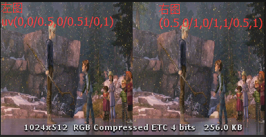
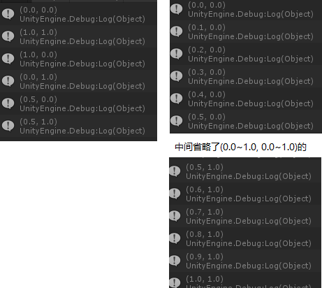
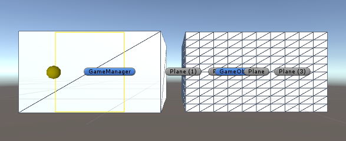

[Back](index.md)

# Quad和Plane的区别

今天在做一个“测测你的3d感”小程序时遇到了一个“Mesh.uv is out of bounds. The supplied array needs to be the same size as the Mesh.vertices array.”显示我设置的uv超出了边界。

> Unity forum 对此的解释是：This kind of error happens when you try to assign an array of uv which is longer (or shorter?) than the vertices array.   

先交代一下这个bug的出现背景，我的程序是要干啥的：
一幅左右图画面，我把它贴在一个quad或者plane上，在左右相机分别显示不同的画面，如下图，左边的画面投射到左眼，右边的画面投射到右眼，这也是3D电影的原理，画面本身没有3D，而是模拟人眼看到的两眼画面，由大脑处理得来的，所以这种左右格式的图片，设定好左右相机渲染不同的uv值，就可以将这两个画面贴在一个quad上，分开来显示。



我在判断这种格式的图片后，会给它添加一个mesh，通过不同的mesh来区分显示，一开始我使用的是plane，一运行得到了Mesh.uv is out of bound错误

``` csharp
public static Vector2[] LUVS = 
	new Vector2[] { new Vector2(0, 0), new Vector2(0.5f, 1), new Vector2(0.5f, 0), new Vector2(0, 1) };      // 左 1/2
public static Vector2[] RUVS = 
	new Vector2[] { new Vector2(0.5f, 0), new Vector2(1, 1), new Vector2(1, 0), new Vector2(0.5f, 1) };      // 右 1/2

public class MeshUVItem
{
    public GameObject gameObject;
    public Mesh mesh;
    public Vector2[] LUVS;
    public Vector2[] RUVS;
    public float textureOffset;
    public int mode;
}

case StereoMode.SDS3D_ORDER_LEFT_RIGHT:
    {
        // 暂时只设置左右，不做其他和裁剪
        // 新建一个自定义mesh，包含了左右uv属性
        mMeshUVItem = new LRStereoProcessor.MeshUVItem();
        mMeshUVItem.mode = this.currentStereoMode;
        mMeshUVItem.gameObject = this.gameObject;

        // 给这个mesh赋值，和当前gameobject的mesh保持一致
        mMeshUVItem.mesh = this.gameObject.GetComponent<MeshFilter>().mesh;

        mMeshUVItem.LUVS = LRStereoProcessor.LUVS;
        mMeshUVItem.RUVS = LRStereoProcessor.RUVS;

    	// 将这个MeshUVItem添加进一个负责渲染左右不同画面的执行队列中
        LRStereoProcessor.addMeshItem(mMeshUVItem);
    }
    break;

```

上面的代码可以看出创建了一个新的MeshUVItem，形状和当前MeshFilter保持一致，设置mesh的图片采样uv，再通过LRStereoProcessor处理左右画面，形成3D效果。



``` csharp
public class MeshUVItem
{
    public GameObject gameObject;
    public Mesh mesh;
    public Vector2[] LUVS;
    public Vector2[] RUVS;
    public float textureOffset;
    public int mode;

    public bool stereMode
    {
        get
        {
            return StereoMode.is3DMode(mode);
        }
    }

    public virtual void RenderLR(bool isLeft)
    {
        if (stereMode)
        {
            if (isLeft)
            {
            	// 就是这里和mesh.uv = RUVS出错，如果在这里foreach打印mesh.uv
            	// 会得到quad & plane不同的结果，quad只有一个结果，但plane对应的很多            	
                mesh.uv = LUVS;
            }
            else
            {
                mesh.uv = RUVS;
            }
        }
        else
        {
            mesh.uv = WUVS;
        }
    }
}

```

由此可以得到一个结果：plane是由非常多mesh形成的，尽管他和quad一样是个平面，可以想象为多个quad合并成为了一个plane.

在Unity里打开wireframe显示，也能够很清楚地看到顶点和网格数量上的差别。


因此平面海报之类的使用quad就可以了，带有顶点shader动画的海洋波浪图片，这种情况下才需要使用plane.