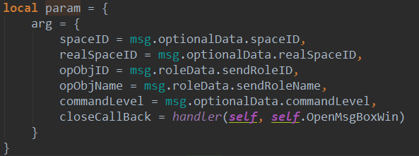
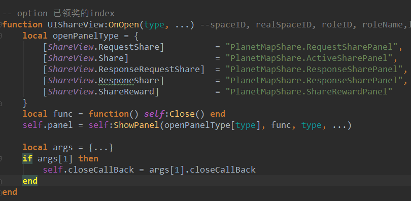

[Back](index.md)
# 变长参数的使用和误区

lua可以支持不同数量的实参，参数不限类型，可以是int, float, table，print()就是lua支持变长参数的函数，比如说
print(1,2,3,4) 的结果是    1    2    3    4

``` lua
function add(...)
    local s = 0
    for i, v in ipairs{...} do
        s = s + v
    end
    return s
end

print(add(3,4,10,25,12))    --> 54
```
ipairs{...}把传入的变长参数作为一个table遍历，具体有多少个参数不知道，在ipairs时候也不用关心有几个参数，ipairs的用法和C# foreach类似，i,v分别是遍历的索引和值。

这三个点是作为一个表达式使用，一个函数要访问这些变长参数时，仍然需要用到这3个点，而{...}表示一个由所有变长参数构成的数组


我遇到一个变长参数的使用误区，问怎么传过来要arg[1].closeCallBack这样使用


OpenWindow(_, _, param.arg)

...是传入的变长参数内容，即
``` lua
arg = {

}
```

而这位同学在接收参数后又进行了args = {...}的操作，相当在原param上又包了一层，就变成了一个arg2数组了
``` lua
arg2 = {
    arg = {

    }
}
```

**表达式"..."的行为类似于一个具有多重返回值的函数，他返回的是当前函数的所有变长参数**

举个栗子：
local a, b = ... 这样它其实返回了a,b两个变量，如果不足两个，则为nil

再来：
``` lua
function foo(...)
    local a, b, c = ...
end
```
它只是简单地返回调用它时传入的实参，是个“多值恒定式”，它的行为类似function id(...) return ... end


**我不想在函数里写那么多参数**
function OnOpen(type, spaceID, realSpaceID, roleID, roleName,logID, isAward, option)
这个函数我需要传（类型，星区号，真实星区号，角色id，角色名称，迷雾id，是否奖励面板，操作）

当初在设计时，为了重用一个大的页面背景板，所以共享/分享/接受共享/接受分享/奖励，都要通过这个函数传入各自需要的参数，如果不需要某个参数的话用_代替，但是参数传递的顺序不能错。

OnOpen(type, _, _, roleID, roleName, _, _, _)
比如这样我就只传了type, roleID, roleName，但这样子每个位置传什么，我还要到对应的函数定义处看，不免有些麻烦。


如果是变长参数 function OnOpen(...)，我在传参时也差不多是上面的样子
OnOpen(type, _, _, roleID, roleName) 不同的是后面不需要的参数，不用占位。


还有一种方式，把需要传递的参数，封装成一个table，各个界面自己取自己需要的东西，每个调用处也就封装需要传递的参数。
``` lua
arg = {
    type = _type,
    roleID = _roleID,
    roleName = _roleName,
}
OnOpen(arg)

-- ...
function OnOpen(arg)
    self.type = arg.type
    self.roleID = arg.roleID
    self.roleName = arg.roleName
end
```