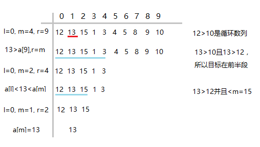

[back](index.md)

# 

如果有一个有序但不连续的升序数列，连续多次向右循环移动，即最后一位移动到数列第一位，以此类推。
原数列：1，3，4，5，6，8，9，11，14
移动后：9，11，14，1，3，4，5，6，8

要使用一种最高效的方式找出任意一个数的索引下标。


注意这个升序数列有一个规则是：第一位比最后一位小。
那么依照这个规则可以判断出这个数列经过N次右循环后，是否刚好是从头到尾升序，这样的数列查找最快的方式是折半查找。

解题思路：
1. 判断数列是否有序（第一位小于最后一位）；
2. 折半后，数列为一半有序，一半无序；
3. 判断查找目标数所在的区域，是有序的一半还是无序的一半；
4. 有序的进行折半查找，无序的重复2，3，4操作。


归根到底还是折半查找，只不过这个折半查找的判断区域条件比较特殊，想清楚了这个就容易一些了。


如果是 9，11，14，1，3，4，5，6，8 这个序列，找到11：



先记录下，这段代码还有些问题
``` csharp

using System;
namespace ConsoleApplication1
{
    class Program
    {
        static int FindNumber(int[] array, int n)
        {
            int l = 0;
            int r = array.Length - 1;
            int m = (l + r) / 2;

            while(l <= r)
            {
                if(array[l] < array[r])
                {
                    if (n < array[m])
                        r = m;
                    else if (n > array[m])
                        l = m;
                    else
                        return m;
                }
                else
                {
                    if (n == array[m])
                        return m;
                    else if (n >= array[l])
                        r = m;
                    else
                        l = m;

                }
                Console.WriteLine(l + " " + r);
                m = (l + r) / 2;
            }

            return -1;
        }

        static void Main(string[] args)
        {
            int[] array = new int[] { 9, 11, 14, 22, 30, 1, 3, 4, 6, 7 };
            while (true)
            {
                int n = Int32.Parse(Console.ReadLine());
                Console.WriteLine(FindNumber(array, n));
            }
        }
    }
}

```

[循环有序数组的二分查找](http://log4think.com/binary_search_sorted_loop_array/)